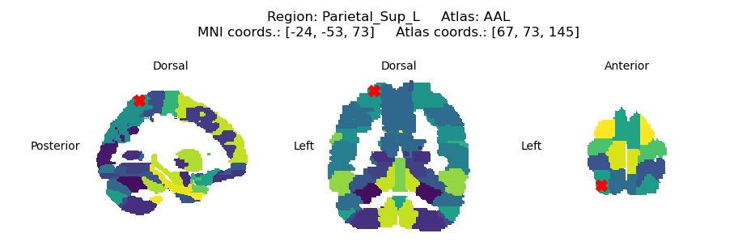

# mni-to-atlas
A simple Python-based tool for finding brain atlas regions based on MNI coordinates, with basic plotting abilities to show the sagittal, coronal, and axial views of the coordinates on the atlas.

The following atlases are currently supported:
- Automated anatomical labelling atlas [[1]](#References)
- Automated anatomical labelling 3 atlas (1mm<sup>3</sup> voxel version) [[2]](#References)
- Human Connectome Project extended parcellation atlas [[3]](#References)

If there is an atlas you would like to see added, please open an [issue](https://github.com/tsbinns/mni_to_atlas/issues).

Example screenshot of the plotting:


## Requirements:
[See here for the list of requirements](requirements.txt).

## Use Example:
1. Install the package into the desired environment using pip `pip install mni-to-atlas`.
2. Import the `AtlasBrowser` class into your workspace.
3. Create an instance of the `AtlasBrowser` class and specify an atlas to use (can be "AAL", "AAL3", or "HCPEx").
4. Provide MNI coordinates to the `AtlasBrowser` object to find the corresponding atlas regions. The brain regions for these coordinates are then returned as a list of strings.
   - The coordinates should be an (n x 3) array, where each row contains an x-, y-, and z-axis MNI coordinate. 
   - By default, plotting the coordinates is not performed, however this can be changed by setting `plot = True` in the `find_regions` method. In this case, a figure will be generated for each set of coordinates.

In case your MNI coordinates do not correspond to a defined atlas region (e.g., the coordinates correspond to electrodes above the brain surface), the `project_to_nearest` method can be used to project the coordinates to the nearest defined atlas region, before finding the brain regions.

<br>

```python
# Import the AtlasBrowser class
from mni_to_atlas import AtlasBrowser
import numpy as np

# Instantiate the AtlasBrowser class and specify the atlas to use
atlas = AtlasBrowser("AAL3")

# Define MNI coordinates as an (n x 3) array
coordinates = np.array([[-24, -53, 73],
                        [-25, 20, 70]])

# Find the brain regions at the MNI coordinates (plotting is optional)
regions = atlas.find_regions(coordinates, plot=True)
assert regions == ["Parietal_Sup_L", "Undefined"]

# Project 'undefined' coordinates to the nearest defined atlas region
projected_coords = atlas.project_to_nearest(coordinates)
projected_regions = atlas.find_regions(projected_coords)
assert np.all(projected_coords == np.array([[-24, -53, 73], [-24, 18, 66]]))
assert projected_regions == ["Parietal_Sup_L", "Frontal_Sup_2_L"]
```

## References:
1. Tzourio-Mazoyer *et al.* (2002) DOI: [10.1006/nimg.2001.0978](https://doi.org/10.1006/nimg.2001.0978)
2. Rolls *et al.* (2020) DOI: [10.1016/j.neuroimage.2019.116189](https://doi.org/10.1016/j.neuroimage.2019.116189)
3. Huang *et al.* (2022) DOI: [10.1007/s00429-021-02421-6](https://doi.org/10.1007/s00429-021-02421-6)
